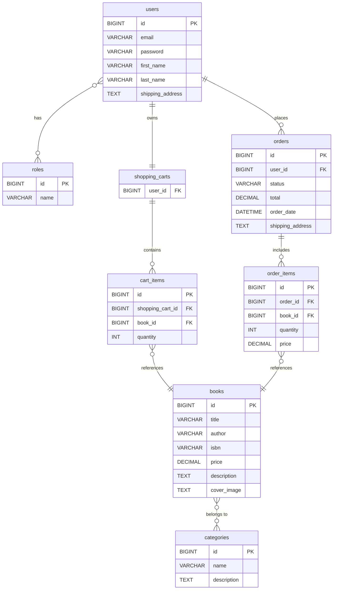

# 📚 Online Book Store

> A fully-featured RESTful backend for an online bookstore — built with Spring Boot 3, secured with JWT, and ready to deploy with Docker.

---

## 🧭 Table of Contents

- [About the Project](#-about-the-project)
- [Tech Stack](#-tech-stack)
- [Architecture Overview](#-architecture-overview)
- [API Endpoints](#-api-endpoints)
- [Getting Started](#-getting-started)
- [Environment Variables](#-environment-variables)
- [Running with Docker](#-running-with-docker)
- [Running Tests](#-running-tests)
- [Challenges & Solutions](#-challenges--solutions)
- [Author](#-author)

---

## 📖 About the Project

Finding and buying books online should be simple. This project is a backend REST API for an online bookstore that handles everything from browsing a catalog to placing an order — all secured with role-based access control.

**What it covers:**
- Users can register, log in, browse books and categories, manage a shopping cart, and place orders
- Admins can manage the book catalog and update order statuses
- All sensitive endpoints are protected with JWT authentication
- Database migrations are managed automatically via Liquibase
- The full API is documented and explorable through Swagger UI

---

## 🎬 Demo

[▶ Watch the demo](https://www.loom.com/share/89c9609b465c4cedb15efb7858fec705)

## 🛠 Tech Stack

| Layer | Technology                       |
|---|----------------------------------|
| Language | Java 17                          |
| Framework | Spring Boot 3.3.5                |
| Security | Spring Security + JWT            |
| Persistence | Spring Data JPA + Hibernate      |
| Database | MySQL 8                          |
| Migrations | Liquibase                        |
| Mapping | MapStruct                        |
| API Docs | SpringDoc OpenAPI (Swagger UI)   |
| Containerization | Docker + Podman                  |
| Build tool | Maven                            |
| Code quality | Checkstyle                       |
| Testing | JUnit 5, Mockito, Testсontainers |

---

## 🏗 Architecture Overview

```
┌────────────────────────────────────────────────────┐
│                    Client (HTTP)                   │
└────────────────────────────────────────────────────┘
                           │
                           ▼
┌────────────────────────────────────────────────────┐
│               Spring Security Filter               │
│                (JWT Authentication)                │
└────────────────────────────────────────────────────┘
                           │
                           ▼
┌────────────────────────────────────────────────────┐
│                  REST Controllers                  │
│     Auth | Books | Categories | Cart | Orders      │
└────────────────────────────────────────────────────┘
                           │
                           ▼
┌────────────────────────────────────────────────────┐
│           Service Layer (Business Logic)           │
└────────────────────────────────────────────────────┘
                           │
                           ▼
┌────────────────────────────────────────────────────┐
│         Repository Layer (Spring Data JPA)         │
└────────────────────────────────────────────────────┘
                           │
                           ▼
┌────────────────────────────────────────────────────┐
│                   MySQL Database                   │
│               (Liquibase migrations)               │
└────────────────────────────────────────────────────┘
```

---



---

## 🔌 API Endpoints

### 🔐 Authentication (`/api/auth`)
| Method | Endpoint | Description | Access |
|--------|----------|-------------|--------|
| POST | `/registration` | Register a new user | Public |
| POST | `/login` | Login and receive JWT token | Public |

### 📚 Books (`/api/books`)
| Method | Endpoint | Description | Access |
|--------|----------|-------------|--------|
| GET | `/` | Get all books (paginated) | User |
| GET | `/{id}` | Get book by ID | User |
| GET | `/search` | Search books by params | User |
| POST | `/` | Create a new book | Admin |
| PUT | `/{id}` | Update book | Admin |
| DELETE | `/{id}` | Soft-delete book | Admin |

### 🗂 Categories (`/api/categories`)
| Method | Endpoint | Description | Access |
|--------|----------|-------------|--------|
| GET | `/` | Get all categories | User |
| GET | `/{id}` | Get category by ID | User |
| GET | `/{id}/books` | Get books in category | User |
| POST | `/` | Create category | Admin |
| PUT | `/{id}` | Update category | Admin |
| DELETE | `/{id}` | Delete category | Admin |

### 🛒 Shopping Cart (`/api/cart`)
| Method | Endpoint      | Description | Access |
|--------|---------------|-------------|--------|
| GET | `/`           | Get current user's cart | User |
| POST | `/`           | Add item to cart | User |
| PUT | `/items/{id}` | Update item quantity | User |
| DELETE | `/items/{id}` | Remove item from cart | User |

### 📦 Orders (`/api/orders`)
| Method | Endpoint | Description | Access |
|--------|----------|-------------|--------|
| POST | `/` | Place an order | User |
| GET | `/` | Get order history | User |
| GET | `/{orderId}/items` | Get items in order | User |
| GET | `/{orderId}/items/{itemId}` | Get specific item | User |
| PATCH | `/{id}` | Update order status | Admin |

---

## 🚀 Getting Started

### Prerequisites

- Java 17+
- Maven 3.8+
- Docker & Docker Compose

### Clone the repository

```bash
git clone https://github.com/Krupkolllia/online-book-store.git
cd online-book-store
```

---

## ⚙️ Environment Variables

Copy `.env.sample` to `.env` and fill in the values:

```bash
cp .env.sample .env
```

```env
JWT_SECRET=your_jwt_secret_key
JWT_EXPIRATION=86400000

MYSQLDB_USER=root
MYSQLDB_ROOT_PASSWORD=your_password
MYSQLDB_DATABASE=book_store

MYSQLDB_LOCAL_PORT=3307
MYSQLDB_DOCKER_PORT=3306

SPRING_LOCAL_PORT=8080
SPRING_DOCKER_PORT=8080
```

---

## 🐳 Running with Docker

The easiest way to run the full application (app + database):

```bash
docker-compose up --build
```

The API will be available at: `http://localhost:8080/swagger-ui/index.html`

To stop:
```bash
docker-compose down
```

### Running locally (without Docker)

Make sure MySQL is running locally, then:

```bash
./mvnw spring-boot:run
```

---

## 🧪 Running Tests

```bash
./mvnw test
```

Tests use Testcontainers — a real MySQL instance spins up automatically, no manual setup needed.

---

## 💡 Challenges & Solutions

**JWT integration with Spring Security 6**
Spring Security 6 removed the legacy `WebSecurityConfigurerAdapter`. Migrating to the new component-based security configuration required restructuring the security setup using `SecurityFilterChain` beans and custom JWT filters — cleaner, but a steep learning curve.

**Soft deletes with JPA**
Books and users aren't physically deleted from the database — they're marked as inactive via a `deleted` flag. Implementing this transparently required custom `@Where` annotations on entities so that deleted records are automatically excluded from all queries.

**Liquibase migration order**
Managing Liquibase changelogs across multiple features required careful ordering of changesets to avoid conflicts when foreign key constraints were involved. The solution was strict naming conventions and a single master changelog file that controls execution order.

**MapStruct + Lombok interaction**
Getting MapStruct and Lombok to cooperate in the Maven annotation processor pipeline required explicit ordering of annotation processors in `pom.xml` — Lombok must run before MapStruct.

---

## 👤 Author

**Krupkolllia**
- GitHub: [@Krupkolllia](https://github.com/Krupkolllia)

---

> ⭐ If you find this project useful, consider giving it a star!